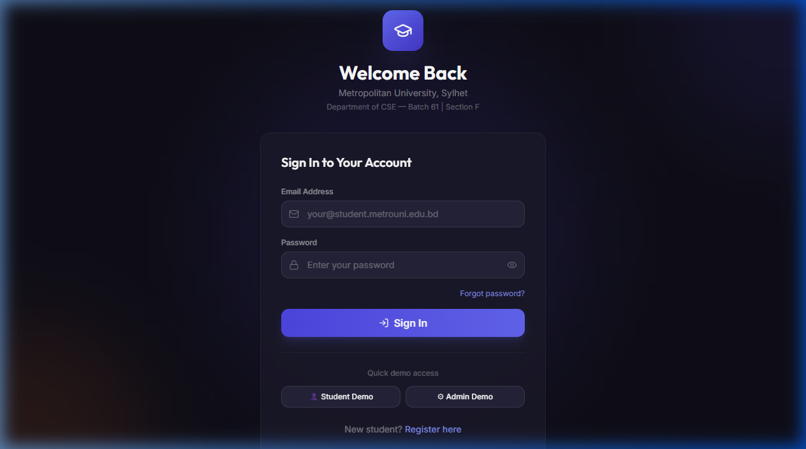
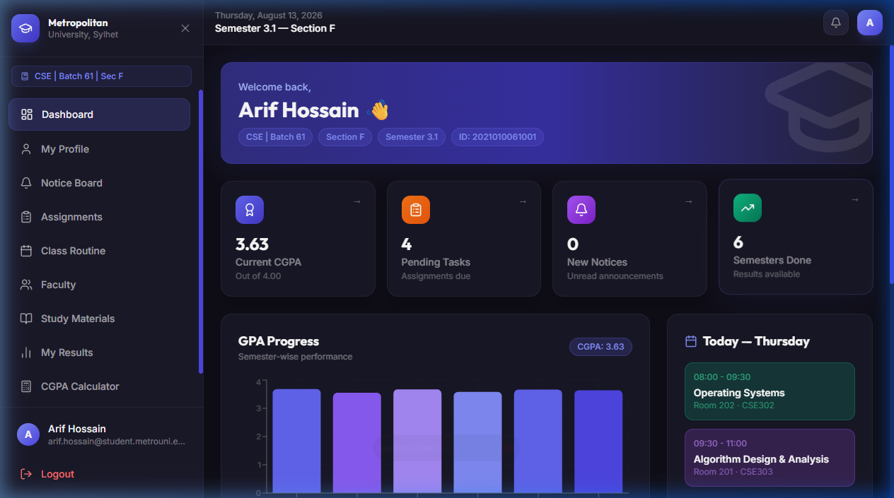
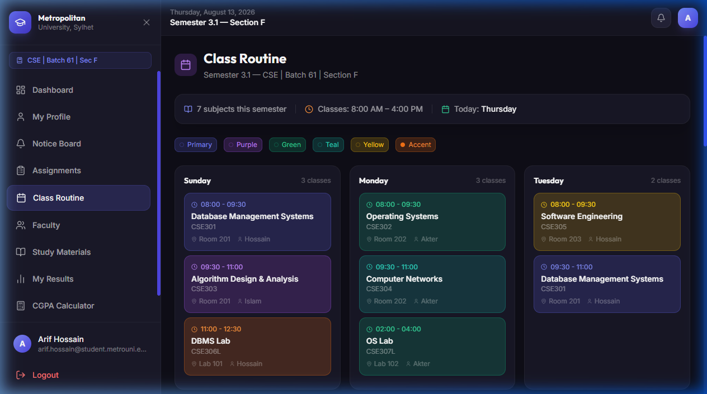
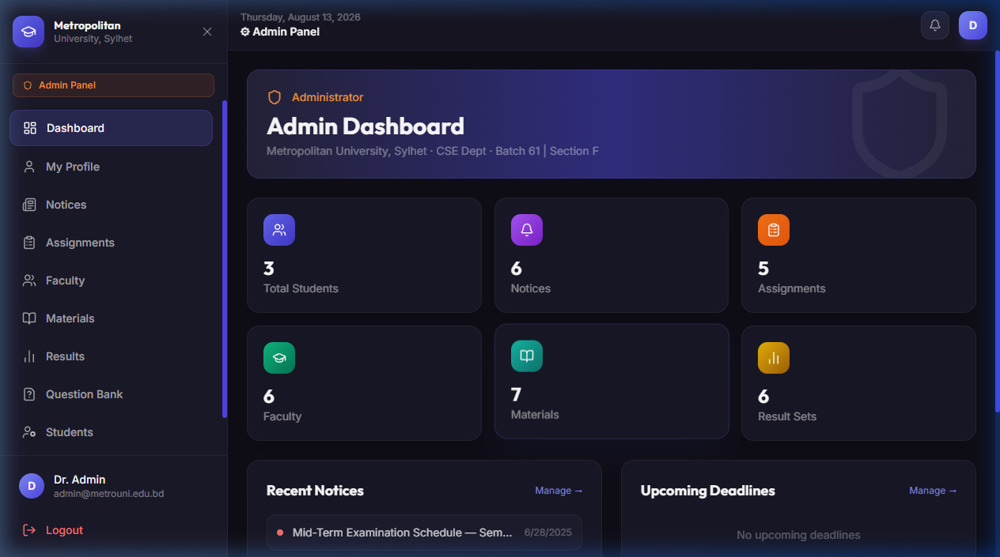
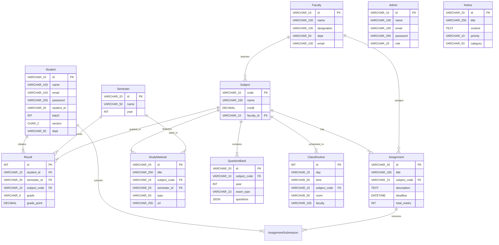

# 🚀 Section Management & Academic Tracking System

---

## 📌 Overview

Section Management & Academic Tracking System is a centralized, web-based platform designed for university sections to coordinate all academic resources. It helps students securely log in to access routines, notes, and notices, while providing automated semester GPA and CGPA calculations. The administrative dashboard allows reps and faculty to easily upload resources, post announcements, and manage student grades.

---

## 👥 Group Details

* **Group Number:** Batch 61 (Section F)
* **Course Name:** Database Management System (CSE 223)
* **Instructor:** Md. Fahmidur Rahman Sakib (Lecturer, Department of Computer Science & Engineering)

### 🧑‍🤝‍🧑 Team Members

| Name | ID | Contribution |
| --- | --- | --- |
| Abid Ahmed Sunny | 242-115-285 | Led frontend/backend core development, main app structure, API integration, and dashboard components. |
| Din Mohammed Toufik | 242-115-265 | Designed the 3NF-normalized MySQL schema (10 tables), GPA/CGPA modules, class routine, and study materials. |
| Mirza Raiyan Rahman | 242-115-255 | Built authentication (registration, login, role-based access, 4-step OTP wizard) and Vercel CI/CD deployment. |
| Hamza Choudhury | 242-115-270 | Designed UI/UX with Tailwind CSS and Lucide, ensured responsiveness, and managed testing/bug fixes. |
| Toyyoba Akter | 242-115-263 | Contributed to UI/UX design, database data seeding inputs, and database ER diagrams. |

---

## 🎯 Objective

The primary objective of this project is to eliminate the confusion and disorganization of managing section-level academic resources through scattered social media groups. By centralizing routines, schedules, notices, assignments, and results on a single secure platform, the system ensures important updates are never lost, helps students meet deadlines, and automates CGPA tracking and GPA calculations to reduce manual errors.

---

## ✨ Features

* ✅ **Authentication System**: Student registration, secure login, forgot password recovery, and session management.
* ✅ **Academic Information Management**: Class routine view, class notes download, assignment instructions, homework updates, and priority-tagged academic notices.
* ✅ **Faculty Information Directory**: Clear records of faculty names, designations, courses taught, contact details, and office hours.
* ✅ **Academic Tracking System**: Semester-wise result tracking, course-wise grade inputs, automatic GPA/CGPA calculation, and credit weight management.
* ✅ **Search and Filter Utilities**: Quick search of subject codes, notes, assignment titles, and filters for semester results.
* ✅ **Role-Based Dashboards**: Customized workspace for student access and an administrative portal for managing resources, posting notices, and updating grades.

---

## 🖼️ Project Preview

### 🔹 UI Screenshots

#### 🔑 Login Page


#### 👤 Student Portal - Dashboard


#### 📅 Student Portal - Class Routine


#### ⚙️ Administrative Dashboard


### 🔹 ER Diagram



---

## 🏗️ Tech Stack

**Frontend:**
Built using **HTML**, **CSS**, **JavaScript**, **Tailwind CSS**, and **DaisyUI** frameworks for high flexibility and modern layout responsiveness. Employs **React (Vite)** for component composition, **React Router v7** for routing, **Recharts** for visualizing result performance and grade distribution charts, and **Lucide React** for dynamic icons.

**Backend:**
Implemented using **Node.js** and the **Express** framework to construct a robust REST API layer. Features password hashing with **bcryptjs**, cross-origin support with **cors**, and handles environment settings dynamically using **dotenv**.

**Database:**
Uses **MySQL** (fully compatible with XAMPP and MySQL Workbench) designed around 10 core entities. Key DBMS structures include primary keys, foreign keys (`ON DELETE CASCADE` and `ON DELETE SET NULL` constraints) to ensure relational integrity, custom indexes for optimization, check validation constraints, and multi-column unique keys.

---

## ⚙️ Installation & Setup

### 1️⃣ Database Import
Ensure you have MySQL installed (e.g., via XAMPP or direct download). Create the database and import the files located in the `/database` directory:
```bash
# Log in and create the database
mysql -u root -p
CREATE DATABASE academic_management;
exit;

# Import DDL schema and initial seed data
mysql -u root -p academic_management < database/schema.sql
mysql -u root -p academic_management < database/sample_data.sql
```

### 2️⃣ Backend Configuration & Startup
1. Navigate to the `server/` directory:
   ```bash
   cd server
   ```
2. Install backend node packages:
   ```bash
   npm install
   ```
3. Create database configurations from the example template:
   ```bash
   cp .env.example .env
   ```
4. Set your local database credentials inside the newly created `.env` file.
5. Start the backend:
   ```bash
   npm run dev
   ```

### 3️⃣ Frontend Client Startup
1. In a separate terminal shell, navigate to the project root:
   ```bash
   cd ..
   ```
2. Install frontend dependencies:
   ```bash
   npm install
   ```
3. Boot the local development client:
   ```bash
   npm run dev
   ```
4. View the web interface at `http://localhost:5173`.

### 🔑 Quick Demo Login Credentials
You can type the following test accounts:
* **Student Account:**
  * **Email:** `arif.hossain@student.metrouni.edu.bd`
  * **Password:** `student123`
* **Admin Account:**
  * **Email:** `admin@metrouni.edu.bd`
  * **Password:** `admin123`

---

## 🗂️ Project Structure

```
/dbms-project-root
│── database/             # MySQL DDL Schema, seed data, and ER diagram docs
│── public/               # Public static assets for the React application
│── server/               # Node.js + Express backend server
│   │── scripts/          # Seeding script for loading sample data
│   │── db.js             # MySQL database connection helper
│   │── server.js         # API routes and server server logic
│   └── .env.example      # Environment variable template
│── src/                  # React (Vite) Frontend source code
│   │── assets/           # UI images and assets (like hero banner)
│   │── components/       # Reusable React UI components
│   │── context/          # React Context providers (Auth Context)
│   │── data/             # Fallback mock data structures
│   │── pages/            # Page layouts (Login, Student and Admin interfaces)
│   │── services/         # API service client logic (api.js)
│   └── main.jsx          # React app entry point
│── package.json          # Vite configuration and frontend dependencies
└── README.md             # Project documentation
```

---

## 🎥 Demo Video

👉 [Watch Project Demo](#) *(Add your video link here)*
