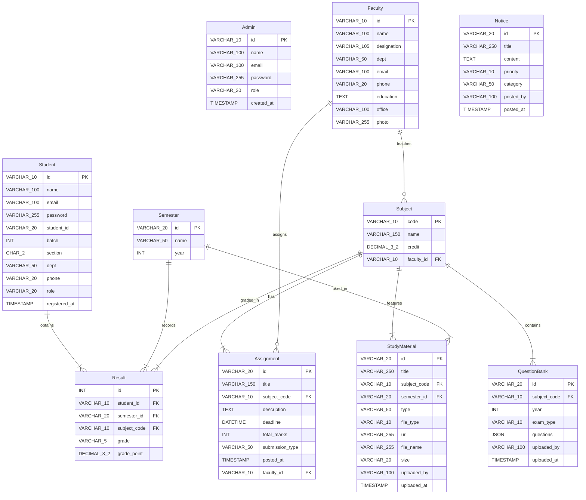

# Entity-Relationship (ER) Diagram

Below is the Entity-Relationship Diagram representing the database design for the **Academic Management Platform**. It details the tables, attributes, primary keys (`PK`), foreign keys (`FK`), and the relationships between the entities.

## Description of Relationships

1. **Faculty & Subject (`1:N`)**: A Faculty member can teach multiple Subjects, but a Subject is taught by one Faculty member (can be NULL if not assigned yet).
2. **Student & Result (`1:N`)**: A Student obtains multiple Semester Results. If a Student is deleted, their results are deleted automatically (`ON DELETE CASCADE`).
3. **Semester & Result (`1:N`)**: A Semester records multiple Results.
4. **Subject & Result (`1:N`)**: A Subject can have multiple Results graded under it.
5. **Subject & Assignment (`1:N`)**: A Subject can host multiple Assignments.
6. **Faculty & Assignment (`1:N`)**: A Faculty member can assign multiple Assignments.
7. **Subject & Study Material (`1:N`)**: A Subject features multiple Study Materials.
8. **Semester & Study Material (`1:N`)**: Study Materials are categorized by Semesters.
9. **Subject & Question Bank (`1:N`)**: A Subject has multiple previous year question papers in the question bank.
